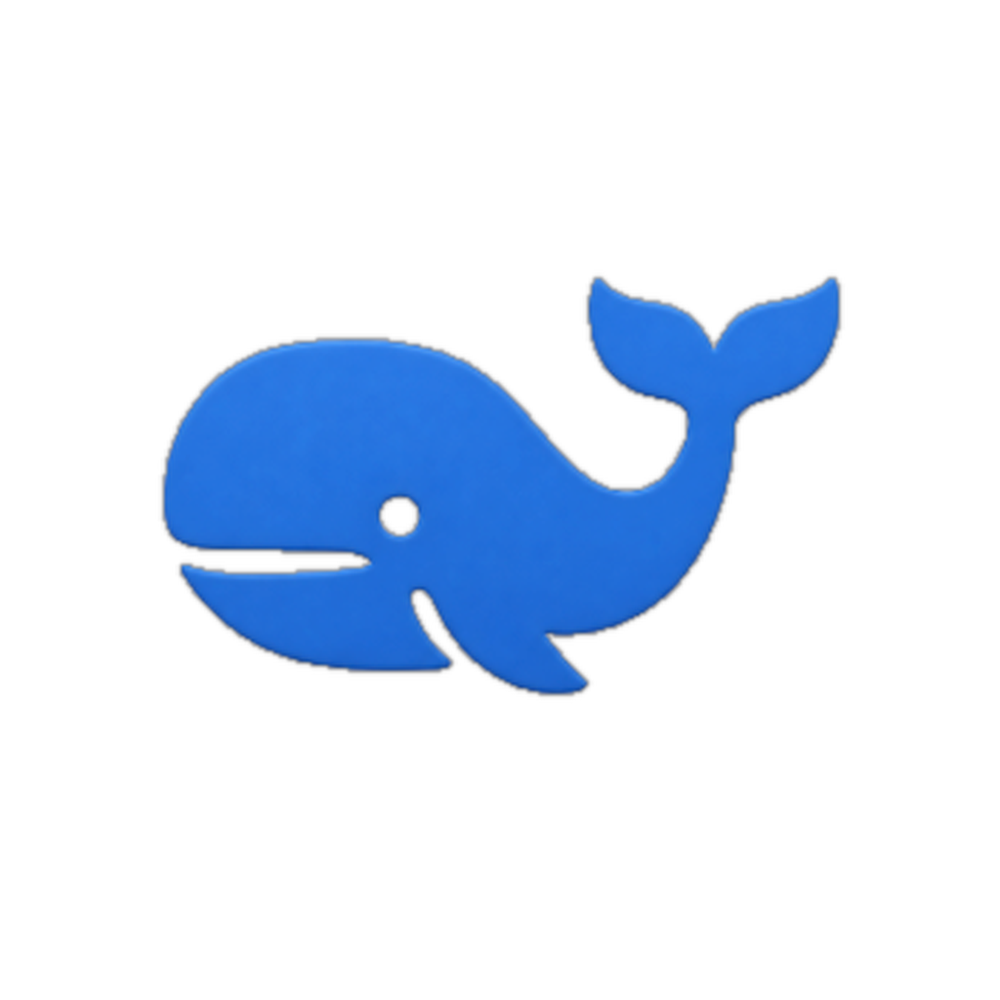
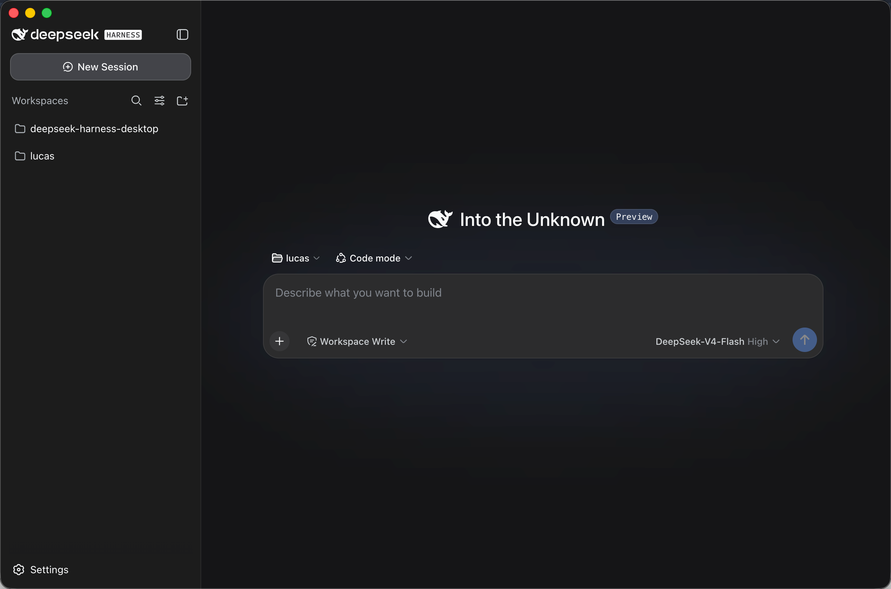

<h1 align="center">
  
  DeepSeek Harness Desktop
</h1>

[English](README.md) | 中文

DeepSeek Harness Desktop 是 [DeepSeek Harness](https://github.com/deepseek-ai/deepseek-harness) 的 macOS 桌面应用。它将上游 Web UI 和所需的 Node 运行时打包进原生应用，用户无需 clone 源码或自行配置 Node.js。



## 在 macOS 安装

从 [GitHub Releases](https://github.com/lucaslus/deepseek-harness-desktop/releases) 下载对应架构的 **DMG**：Apple Silicon（M 系列）选择 **arm64**，Intel Mac 选择 **x64**。打开后将 **DeepSeek Harness** 拖进 **Applications**。项目不使用 Apple Developer 证书，因此 macOS 首次打开可能需要 Control-click → **打开** 确认；之后可通过 Finder、Spotlight 和 Dock 正常使用。

应用菜单中的 **Check for Updates…** 会打开 GitHub Releases；下载对应的新 DMG 并替换 Applications 中的应用即可更新。

## 自行构建 DMG

在安装 Node.js 24+ 的 macOS 上运行：

```sh
git clone https://github.com/lucaslus/deepseek-harness-desktop.git
cd deepseek-harness-desktop
corepack enable
pnpm install --frozen-lockfile
pnpm run build
node apps/electron/scripts/package-mac.mjs
```

产物在 `apps/electron/dist/release/` 中。DMG 用于手动安装，ZIP 是备用压缩包。所有构建均不签名，Gatekeeper 提示及首次 Control-click → **打开** 确认属于正常现象。

## 发布流程

发布工作流会分别构建未签名的 Apple Silicon 与 Intel 版本。先将 `apps/electron/app/package.json` 的版本更新为目标版本，再推送对应的 `electron-v<version>` tag。GitHub Actions 会创建一个**草稿** GitHub Release，其中包含两种 DMG 与两种 ZIP。确认产物后手动发布；不需要 GitHub Actions Secret 或 Apple Developer 账号。

## Upstream

本项目是面向桌面端的 DeepSeek Harness fork。upstream 项目提供 harness、Web UI 和插件架构；本 fork 维护原生 macOS 外壳和桌面工作流。upstream 源码：[deepseek-ai/deepseek-harness](https://github.com/deepseek-ai/deepseek-harness)。

## 开发

请阅读[开发指南](docs/development.md)和[架构文档](docs/architecture.md)。面向 agent，请遵循 [AGENTS.md](AGENTS.md)。

## 许可证

[MIT](LICENSE)。第三方许可证见 [THIRD_PARTY_NOTICES.md](THIRD_PARTY_NOTICES.md)。
